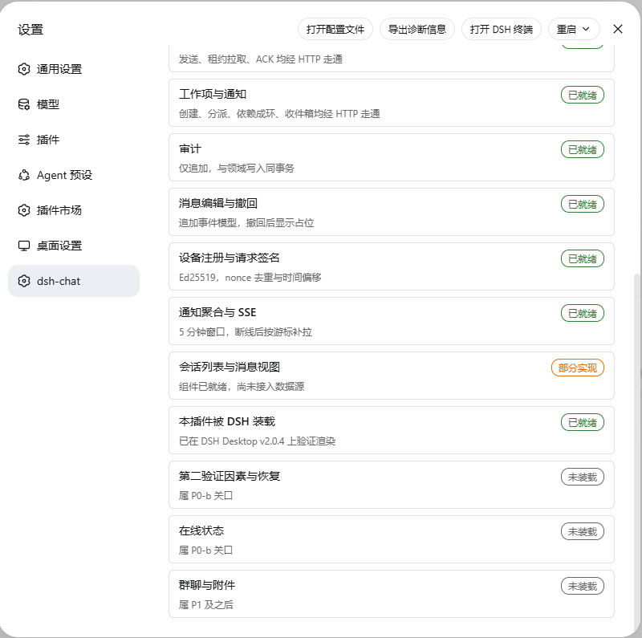
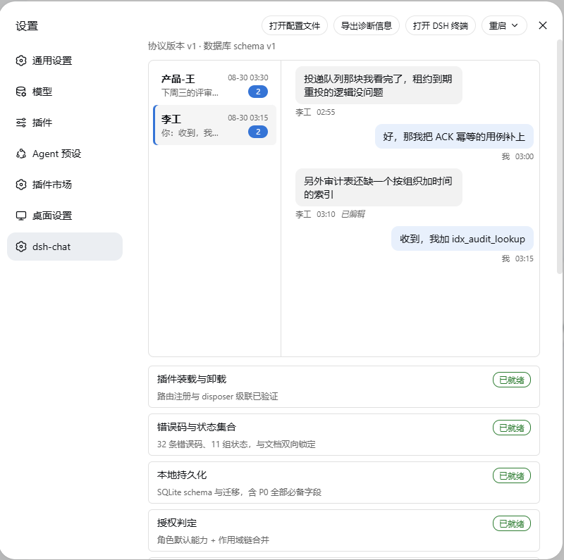
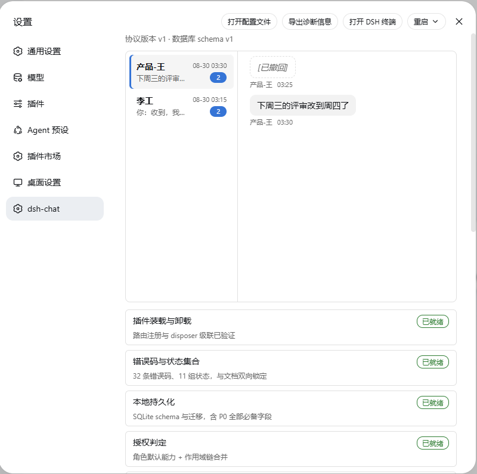
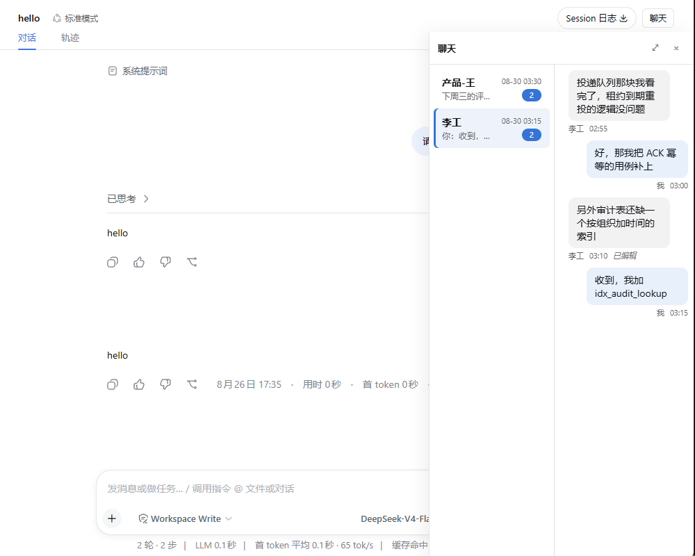

[← 返回 Wiki 首页](../README.md) | **元文档** · DSH 装载验证 | [上一篇：骨架走查记录](./skeleton-walkthrough.md)

---

# DSH 装载验证

本文件记录 dsh-chat 被真实 DSH 装载的验证过程与结果。

> **为什么是文本而不是截图。** 验证在开发者本机的 DSH 实例上进行，其界面包含
> 该开发者的会话标题、工作区路径等个人数据。截图会把这些带进公开仓库，因此
> 这里保留 `--dump-config` 的输出 —— 它更精确（能证明条目进入了插件树的哪个位置），
> 且不含任何个人信息。截图留在本地 `build/evidence/`，该目录已被 gitignore。

## 环境

| 项 | 值 |
|---|---|
| DSH Desktop | `v2.0.4` |
| DSH 运行时 | `0.1.2-alpha.1` |
| 装载方式 | `link:` 到本仓库的 `packages/chat/kernel` |
| profile | `desktop` |

## 验证一：bundle 进入插件树

`dsh --profile desktop --dump-config` 输出组合后的完整插件树。dsh-chat 的条目出现在其中：

```yaml
# == @dsh-chat/kernel
- id: chat-host
  name: '@dsh-chat/host'
  config: {}
```

整棵树共 **149 个条目**，dsh-chat 是其中之一。这证明：

1. `@dsh-chat/kernel` 被 profile 的 `dsh.profile.bundles` 登记并识别为 bundle；
2. 它的 `cordis.patch.yml` 被解析，条目被插入组合结果；
3. `@dsh-chat/host` 这个包名从 profile 的位置可解析。

## 验证二：启动无错误

```
$ node lib/bin.js
{"level":"info","msg":"config-manager 已挂载", ... "dshVersion":"0.1.2-alpha.1"}
```

启动日志中错误数为 0，窗口标题为 `DeepSeek Harness Desktop`（非 `Recovery`）。

对照：在装入 dsh-chat 之前，同一环境下曾因两个第三方插件的版本错配而进入
Recovery 模式，日志中分别是 `failed to apply loader entry include` 与
`renderer boot failed`。两者处置记录在[实现记录](./implementation-log.md)。

## 验证三：路由注册

host 插件注册的 `/api/chat/health` 在 DSH 的 web server 上存在，但**无法用裸
`curl` 验证** —— DSH 的边缘层在路由匹配之前就对未认证请求返回 403：

```
$ curl -i http://127.0.0.1:43120/api/chat/health
HTTP 403 forbidden

$ curl -i http://127.0.0.1:43120/api/chat/health/不存在的路径
HTTP 403 forbidden
```

两个路径返回相同状态，说明 403 来自鉴权而非路由缺失。路由本身的行为由
`packages/chat/host/src/index.host.spec.ts` 在真实的 `WebServer` 服务上验证：
装载后返回 200、卸载后返回 404、连续装卸 3 轮不因路由冲突抛错。

## 验证四：客户端入口的模块解析（2026-08-30 补）

上面三项验证做完之后，界面一直没有出现。追查下来发现**客户端插件从未被装载**，
而此前的记录把它写成了「组件尚未注册到 slot」—— 那个描述是错的，slot 注册的代码
早已写好并有单元测试。真正的原因有两层。

### 第一层：DSH 不知道这个插件存在

从 profile 目录复现 DSH 的模块解析：

```
$ cd ~/.dsh/profiles/desktop && node verify-client-entry.mjs
Error [ERR_PACKAGE_PATH_NOT_EXPORTED]:
  Package subpath './package.json' is not defined by "exports" in
  .../node_modules/@dsh-chat/host/package.json
```

两个问题：`./package.json` 没有导出（DSH 工具链要读它，`dshmarket` 也显式导出了
这一条）；更重要的是 bundle 的 `cordis.patch.yml` 里只有 `@dsh-chat/host`，
而客户端插件在独立的 `@dsh-chat/client` 包里，**没有任何声明指向它**。

DSH 的约定是一个包同时承载两侧：`.` 给 host 端，`./client` 给渲染进程，
并用 `dsh.client` 声明后者存在。profile 里的 `dshmarket` 就是这个形状。
已补上 `./client` 子路径导出与转发模块。

### 第二层：渲染侧入口必须是预打包的单文件

补完导出后再解析，暴露出下一个问题：

```
Error [ERR_MODULE_NOT_FOUND]:
  file:///.../packages/chat/client/dist/client/StatusSection.module.css
```

`tsc` 不会处理 `.module.css`。查上游的构建预设
（`deepseek-harness/packages/client/tsdown.client.ts`）后确认，DSH 的客户端 bundle 是
**闭包工厂**：调 `window.__ModuleLoader__.load({id, factory})`，外部依赖经注入的
`require` 从 loader 模块表解析（不走 import map）；`.module.css` 由 lightningcss
在打包时编译成哈希类名映射，并生成一段运行时注入 `<style>` 的代码。

已发布的 `dshmarket` 的 `client/client.js` 印证了这一点 —— 487 KB 单文件，
CSS 以字符串内联在 `NUL 前缀的 dsh-css:` 区段里。

那个预设是 monorepo 内的相对导入，**没有发布**；`dshmarket` 是自己用
tsdown + lightningcss 重新实现了同一套约定。我们要做同样的事。

### 处置：自建打包，然后声明 `dsh.client`

按上游预设的约定自己实现了打包（`scripts/build-client-bundle.mjs`），
只用 `rolldown` 与 `lightningcss` —— 两者本来就在依赖里（tsdown 是 rolldown
的薄封装），没有引入新的构建工具链。

约定的取值逐条抄自上游预设并在脚本里标了出处：

| 项 | 取值 |
|---|---|
| banner | `window.__ModuleLoader__.load({ id: "@dsh-chat/host", factory: (require) => {` |
| intro | `var module = { exports: {} }; var exports = module.exports;` |
| footer | `return module.exports; } });` |
| 保持 external | `PLATFORM_MODULES` 加本包 `dsh.client.inject` 声明的服务 |
| 其余依赖 | 一律打进 bundle |

打包脚本自带产物校验，不是形式主义：产物是给另一个进程加载的，**构建成功不等于
它能跑**，上一轮界面出不来正是因为没人检查过产物长什么样。校验四条：闭包工厂
形态、结尾的 `return module.exports`、无残留 `.css` require、以及**每个
`require()` 的目标都在模块表里**（模块表答不上来的 require 是必然的运行时抛错）。

## 验证五：界面在真实 DSH 上渲染（2026-08-30）

打包接上后重启 DSH Desktop v2.0.4，设置侧栏出现 `dsh-chat` 分区，
能力表完整渲染：



这张图同时证明了几件事：

- **闭包工厂被 loader 接受** —— 分区出现即 `__ModuleLoader__.load` 注册成功
- **slot 注册在真实宿主里生效** —— 不再只是单元测试里的 `ctx.slots.register`
- **CSS Modules 内联可用** —— 卡片边框、三色徽标都来自 `.module.css`，
  说明 lightningcss 编译出的类名映射与注入的 `<style>` 都到位了
- **能力表如实呈现三种状态** —— 已就绪（绿）、部分实现（橙）、未装载（灰）。
  §6 要求可选能力必须显式显示为未安装、不得伪装为可用，这里能看到
  「第二验证因素与恢复」「在线状态」「群聊与附件」都标着未装载

截图只保留设置弹窗：窗口左侧的会话列表含用户的会话标题与工作区名，
不进公开仓库。完整窗口截图留在 gitignore 的 `build/evidence/`。

## 验证六：会话界面接真实数据（2026-08-30）

补上 `/api/chat/conversations` 与 `/api/chat/messages/history` 之后，
界面显示的是**数据库里真实的消息**，不是占位内容。



会话列表带未读角标与「你：」前缀，消息视图分左右气泡，编辑过的那条标注「已编辑」。

撤回的消息显示为占位，且**原文不出现在响应里**：



这一步顺带暴露并修掉了两个真问题，都不是新代码的问题：

### 全部 HTTP 端点从未被插件注册

各端点都有端到端测试，但那些测试**自己起 `WebServer` 并注册路由**。插件的
`apply()` 里长期只有 `/health` —— 处理器写好了不等于插件把它挂上去了。
浏览器一调 `/api/chat/conversations` 就落到 web server 的兜底，界面白屏。

已把 18 条路由集中登记为 `ROUTE_PATHS`，并加了一条测试逐条访问确认它们真的在。
判据不是状态码 —— 空请求体会让多数端点合法地返回 `NOT_FOUND_OR_FORBIDDEN`，
那也是 404，与「路由不存在」的 404 撞了。真正区分两者的是响应头：已注册的路由由
`commandHandler` 应答，一定带 JSON `content-type`；未注册的路径 body 是空的。

### `presentError` 遇到未知错误码会白屏

原实现是 `ERROR_CATALOGUE[code].retryability`，目录里查不到就抛 `TypeError`，
整个分区渲染失败。而错误码是**从网络上来的**，服务端比客户端新时必然出现客户端
不认识的码 —— 一个未知错误码把界面整个搞没，比显示「操作未能完成」糟糕得多。
现在查不到就按 `terminal` 处理，且不给重试入口。

## 验证七：聊天面板移到会话页右侧（2026-08-30）

界面此前落在设置分区里 —— 那是将就，也偏离了 §5：文档明确把「会话列表」
与「消息视图」列为**各自独立的 slot 贡献**，不是设置项。当时只 vendor 了
`settings.section`，别的 slot 拿不到。

现在挂到 `conversation.session.header.utilities`（会话头部右对齐的工具区），
点按钮从右侧滑出一块可调宽度的抽屉：



### 为什么是这个挂载点

DSH 一共 58 个 slot，**没有「右侧栏」这种东西**（`sidebar.*` 是左栏）。
候选里：

| slot | 为什么不用 |
|---|---|
| `conversation.view` | 「rendered one at a time」—— 挂那儿会把 AI 对话整个替换掉，不是并排 |
| `conversation.input.dock` / `.right` | 贴在输入框附近，位置不对 |
| `sidebar.footer.action` | 是左栏 |

`conversation.session.header.utilities` 是离右侧最近、语义又对得上的挂载点：
按钮就在你正在看的对话旁边，不用离开当前页面。抽屉本体 `position: fixed`
并 portal 到 `document.body`。

### 两处只有真机才暴露的问题

**抽屉头部被标题栏盖住。** 第一版写 `top: 0`，而 DSH 有自绘标题栏 ——
抽屉钻到它下面，标题与关闭按钮整个看不见，界面上只剩内容区。不写死偏移量
（标题栏高度随平台与窗口状态变），改为**量**触发按钮的下边缘，抽屉从那里
往下铺。窗口尺寸变化时重量。

**内容只占上面一小块。** `ChatSection` 原来写死 `height: 420px`（为了在设置
面板里不把页面撑长）。放进抽屉后下面空一大片。改成填满容器，高度约束交给
外层：设置面板套一个 420px 的盒子，抽屉给它剩余空间。

顺带一处窄面板下的排版：气泡原来是 `overflow-wrap: anywhere`，380px 宽时
`idx_audit_lookup` 会被劈成两半。改为 `break-word`，只在词确实放不下时才断。

## 未验证的部分

- **多设备与跨主机的界面行为**。当前验证是单机单账号：`P0-a` 还没有设备会话与
  token，插件用配置里的本地身份充当已认证主体（`authenticateFrom` 上标了边界）。
  跨进程投递另有[三进程验收](../../packages/chat/kernel/src/multi-process.host.spec.ts)，
  但那一层没有界面。
- **SSE 推送到界面**。事件流端点已实现，界面目前是打开时拉一次，没有订阅。
- **经 DSH 的端到端聊天**。host 的命令路由已接通并有 HTTP 端点测试
  （发送、拉取、ACK、编辑、撤回、组织、工作项、通知、SSE），
  但那些测试起的是独立的 `WebServer` 实例，不是 DSH 进程内的那一个。
  跨进程投递另有[三进程验收](../../packages/chat/kernel/src/multi-process.host.spec.ts)。

---

[← 上一篇：骨架走查记录](./skeleton-walkthrough.md) | [返回 Wiki 首页](../README.md)
